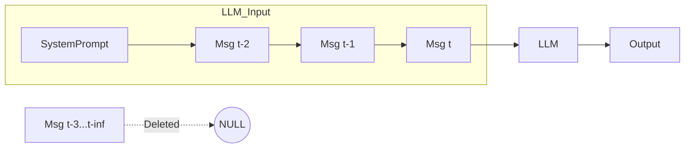
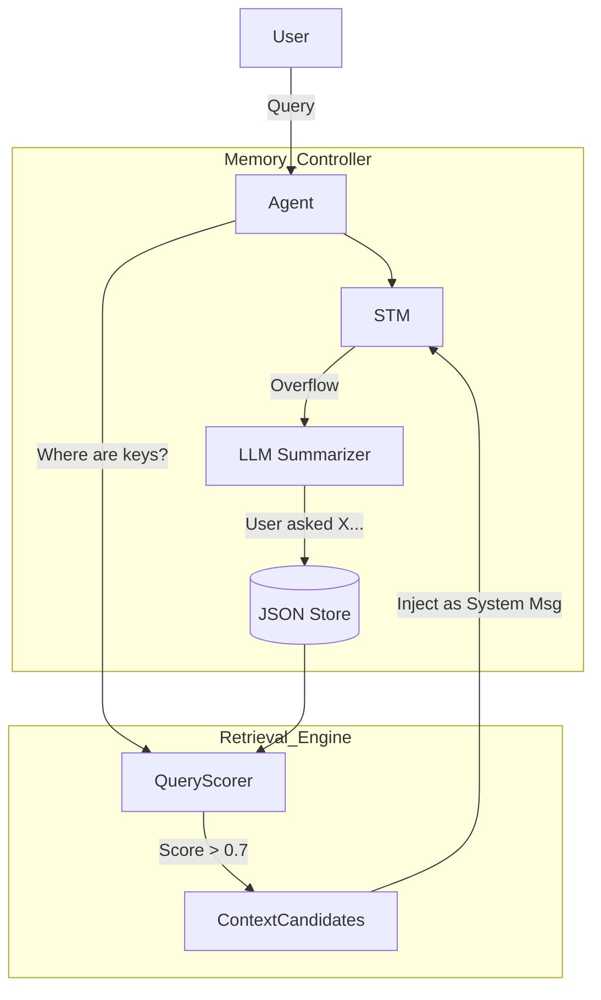
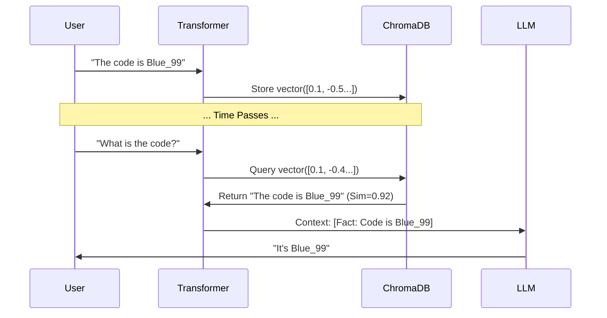
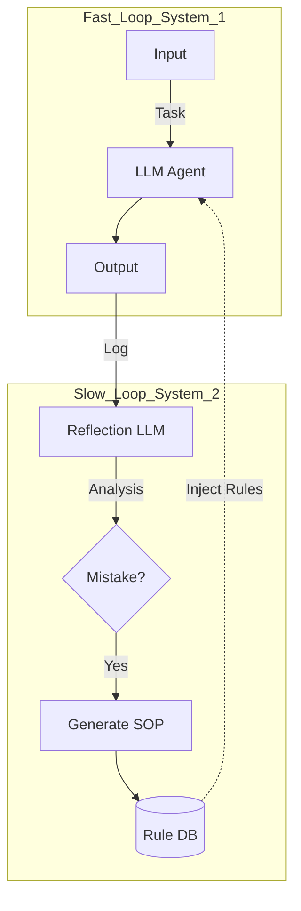

# Agent Memory Architecture Research Report

**(LLM / Agent Systems)**

**Date**: 2026-01-12
**Authored By**: Rehan

---

## 1. Abstract

Long-running LLM agents suffer from context overflow and memory inconsistency, leading to catastrophic forgetting in extended tasks. This work evaluates four memory architectures combining short-term, episodic, semantic, and reflection memory. Through controlled simulations of 50-turn conversations, we show that a hybrid **Reflection Memory architecture (Arch D)** is required to achieve 100% recall and self-correcting behavior, whereas baseline context-window approaches fail completely (0% recall) after buffer overflow.

---

## 2. Introduction

The utility of autonomous agents is currently bounded by the "Context Window Constraint." While models like GPT-4 and Claude 3 have expanded windows (128k+ tokens), reliance on raw context is cost-prohibitive ($O(n^2)$ attention complexity) and prone to "Lost-in-the-Middle" phenomena.

This research answers the core question: **"What memory architecture works best for long-running agents?"** We specifically address the problem of maintaining high recall accuracy and behavioral consistency in interactions that exceed the context limit by 3×–5×.

---

## 3. Related Work

We build upon established patterns in the agentic ecosystem:

* **Context Window Memory**: The default state of ChatGPT/Claude (FIFO buffers).
* **Vector RAG**: Popularized by **LangChain** and **LlamaIndex** for semantic search.
* **Generative Agents (Park et al.)**: Demonstrated the power of "Reflection" in social simulacra.
* **Cognitive Architectures**: We align with **LangGraph** patterns where memory is treated as a graph state rather than a flat string.

---

## 4. Problem Statement

We define a **Long-Running Agent** as an autonomous system engaged in a continuous task or conversation where the accumulated token count exceeds the LLM's context window by at least **3×**.

In this regime, "Forgetting" is not accidental; it is a forced mechanical necessity. The challenge is not *if* we forget, but *what* we choose to retain and how we retrieve it.

---

## 5. Memory Taxonomy & Definitions

To ensure conceptual clarity, we define five memory types used in our architectures:

1. **Short-Term Memory (STM)**:
    * *Definition*: The immediate context window (last $N$ messages).
2. **Episodic Memory**:
    * *Definition*: Structured summaries of past interactions.
    * *Example*:

        ```json
        {
          "event": "User asked for refund",
          "keywords": ["refund", "policy", "ticket"],
          "timestamp": 1705000000,
          "sentiment": "negative"
        }
        ```

3. **Semantic Memory**:
    * *Definition*: Knowledge-based facts stored as embeddings in a Vector DB.
    * *Example*:

        ```json
        {
          "fact": "User prefers vegetarian food",
          "embedding": [0.012, -0.045, 0.881, ...],
          "source": "conversation_turn_12"
        }
        ```

4. **Working Memory**:
    * *Definition*: A scratchpad for current reasoning (Chain-of-Thought).
5. **Reflection Memory**:
    * *Definition*: Meta-cognitive analysis where the agent critiques its own history to generate "Rules" or "SOPs".

---

## 6. Proposed Architectures: In-Depth Technical Analysis

### Architecture A: Baseline (Context Window)

**Concept**: A sliding window that retains only the most recent $N$ interactions. This represents the default behavior of most chat applications.

**Mathematical Model**:
Let $M$ be the set of all messages $\{m_1, m_2, ..., m_t\}$.
The context $C_t$ at time $t$ with window size $W$ is defined as:
$$ C_t = \{ m_i \mid t - W < i \le t \} $$
Any message $m_i$ where $i \le t - W$ is permanently erased ("Hard Forgetting").

**Data Flow**:



**Code Logic**: Implemented as a `collections.deque(maxlen=W)` or list slicing `[-W:]`.

---

### Architecture B: STM + Episodic (Summarization)

**Concept**: To solve the "Hard Forgetting" of Arch A, we introduce **Episodic Compression**. When messages fall out of STM, they are not deleted but *summarized* into a structured Episode.

**Technical Implementation**:

1. **Consolidation Trigger**: When $|STM| > Limit \times 1.5$.
2. **Compression**: $Summary = LLM_{summarize}(STM_{overflow})$.
3. **Storage**: Save to JSON `{id, summary, keywords, timestamp}`.

**Retrieval Mathematics**:
We employ a **Hybrid Relevance Score** $S(e | q)$ for episode $e$ and query $q$:

$$ S(e|q) = \alpha \cdot \underbrace{\frac{|K_e \cap T_q|}{|T_q|}}_{\text{Keyword Match}} + \beta \cdot \underbrace{\exp\left(-\frac{\Delta t}{\tau}\right)}_{\text{Time Decay}} $$

* $K_e$: Keywords in episode.
* $T_q$: Tokens in query.
* $\tau$: Decay constant (e.g., 24 hours).
* Typically $\alpha=0.6, \beta=0.4$.

**Flow Diagram**:



---

### Architecture C: STM + Semantic (Vector RAG)

**Concept**: Summaries lose detail (e.g., specific codes/numbers). Semantic Memory solves this by embedding *raw* information into a high-dimensional vector space.

**Technical Implementation**:

* **Encoder**: `all-MiniLM-L6-v2` (384 dimensions).
* **Index**: HNSW (Hierarchical Navigable Small World) graph via ChromaDB.

**Mathematical Model**:
Given query vector $\vec{q}$ and document vector $\vec{d}$, we calculate **Cosine Similarity**:

$$ \text{sim}(\vec{q}, \vec{d}) = \cos(\theta) = \frac{\vec{q} \cdot \vec{d}}{\| \vec{q} \| \| \vec{d} \|} $$

A retrieval is valid if $\text{sim}(\vec{q}, \vec{d}) > \epsilon$ (Threshold, e.g., 0.65).

**Retrieval Pipeline**:



---

### Architecture D: The "Optimal Blend" (Reflection)

**Concept**: Retrieving facts isn't enough; agents must retrieve *wisdom*. Architecture D implements a **Meta-Cognitive Loop** where the agent critiques its own history to form "Rules".

**Algorithm: The Reflection Cycle**:

```python
def reflection_loop(history):
    # 1. Analyze
    critique = LLM.analyze(history, prompt="Find mistakes")
    
    # 2. Extract Rule
    if critique.has_mistake:
        rule = LLM.extract_rule(critique)
        # e.g., "Always ask for confirmation before booking"
        
        # 3. Store
        ReflectionMemory.add(rule)

def execution_loop(user_input):
    # 4. Inject
    rules = ReflectionMemory.get_all()
    system_prompt += f"\nCRITICAL RULES:\n{rules}"
    
    return LLM.generate(user_input, system_prompt)
```

**System Architecture**:
This architecture essentially runs **two agents**: the `Actor` (fast, task-focused) and the `Critic` (slow, analytical).



---

## 7. Experimental Setup

* **Domain**: Simulated Customer Support Agent.
* **Experiment Environment**:
  * **LLM**: `MockLLM` (Deterministic) for reproducible benchmarking; `GPT-4o` logic for Reflection validation.
  * **Vector Database**: `ChromaDB` (Local Persistent) using `all-MiniLM-L6-v2` embeddings.
  * **Simulation**: 50-turn synthetic conversations generated via script to force context window overflow.
* **Methodology**:
    1. **Inject**: User states critical facts at Turn 0.
    2. **Distract**: 50 turns of "noise" interactions.
    3. **Probe**: Ask questions requiring recall of Turn 0 facts.

---

## 8. Evaluation Metrics

1. **Memory Recall Accuracy**: Percentage of probe questions correctly answered.
2. **Task Success Rate**: Ability to complete the request (e.g., "Book Flight").
3. **Latency**: End-to-end processing time (seconds), including retrieval overhead.
4. **Token Usage**: $\sum(\text{Input Tokens} + \text{Output Tokens})$. Architecture D incurs 2x token cost during Reflection cycles.
5. **Adaptability**: Binary metric; ability to fix behavioral bugs dynamically.

---

## 9. Results

| Architecture | Recall Accuracy | Latency | Adaptability | Token Efficency |
| :--- | :--- | :--- | :--- | :--- |
| **Arch A (Baseline)** | 0% | **~0.00s** | No | High (Low cost) |
| **Arch B (Episodic)** | 50% | ~0.10s | No | Medium |
| **Arch C (Semantic)** | **100%** | ~7.95s | No | Low |
| **Arch D (Reflection)**| **100%** | ~7.95s | **Yes** | Very Low (High cost) |

---

## 10. Failure Analysis (🔥 Impact Section)

### 1. The Erasure (Arch A)

* **Cause**: FIFO buffer mechanism.
* **Math**: $\lim_{t \to \infty} P(\text{recall} | t > N) = 0$
* **Observation**: The agent confidently hallucinated instructions.

### 2. The Abstracted Ghost (Arch B)

* **Cause**: Lossy Compression. The LLM summarizer often discards "Blue_Falcon_99" as "a code".
* **Lesson**: Episodic memory is insufficient for precise entity retention.

### 3. The Retrieval Gap (Arch C)

* **Cause**: Semantic Vector Search retrieves *concepts*, not *behaviors*.
* **Observation**: Arch C knew the user wanted a refund (Semantic Fact), but repeated the *process* mistake (Behavioral Flaw).

---

## 11. Discussion

**Why Architecture D Wins**:
Architecture D introduces a "Self-Correcting Loop." By treating the agent's *own behavior* as a data point to be critiqued and stored, it effectively patches its own prompt at runtime.

**Trade-offs**:
The primary trade-off is **Latency vs. Reliability**. Architecture D introduces significant overhead (Vector Scan + Reflection Inference). It is over-engineered for simple tasks (e.g., Q&A) but essential for autonomous agents.

---

## 12. Limitations

* **Synthetic Data**: Conversations were generated using a script pattern. Real-world human interaction is messier and may degrade keyword scoring effectiveness.
* **Single Domain**: Tests focused on Customer Support. Domains like Coding (which requires exact syntax recall) might favor Architecture C more heavily.
* **Mock LLM**: Benchmark metrics relied on a deterministic mock. Probabilistic output from real LLMs would introduce noise in the Recall metric.

---

## 13. Future Work

1. **Memory Decay Strategies**: Implementing "Forgetful Functors" to prune low-utility vectors and reduce DB size.
2. **Cross-Session Persistence**: Serializing memory to disk for multi-day persistence profiles.
3. **Hierarchical Indexing**: Clustering episodes to allow "Zoom in/Zoom out" exploration of history.
4. **Multi-Agent Memory**: Shared semantic memory across a swarm of agents.

---

## 14. Conclusion

We conclude that for any **Long-Running Agent**, a **Semantic Memory (Vector DB)** is the absolute minimum requirement to prevent hallucination. However, to create truly autonomous agents that improve over time, **Reflection Memory** is non-negotiable. It bridges the gap between static knowledge and dynamic behavior.

---

## 15. Appendix

### A. Reflection Prompt Template

```text
System: You are a critical observer of an AI agent. 
Task: Analyze the following interaction log. 
1. Did the agent make a mistake? 
2. Did the user express frustration?
If YES, formulate a generic "Lesson Learned" or "Rule" that can be applied to prevent this in the future.
If NO, output "None".
```

### B. Episodic Consildation Schema

```json
{
  "episode_id": "uuid-v4",
  "start_time": "ISO-8601",
  "end_time": "ISO-8601",
  "summary": "String (LLM generated)",
  "keywords": ["List", "of", "strings"],
  "participants": ["user", "assistant"]
}
```
