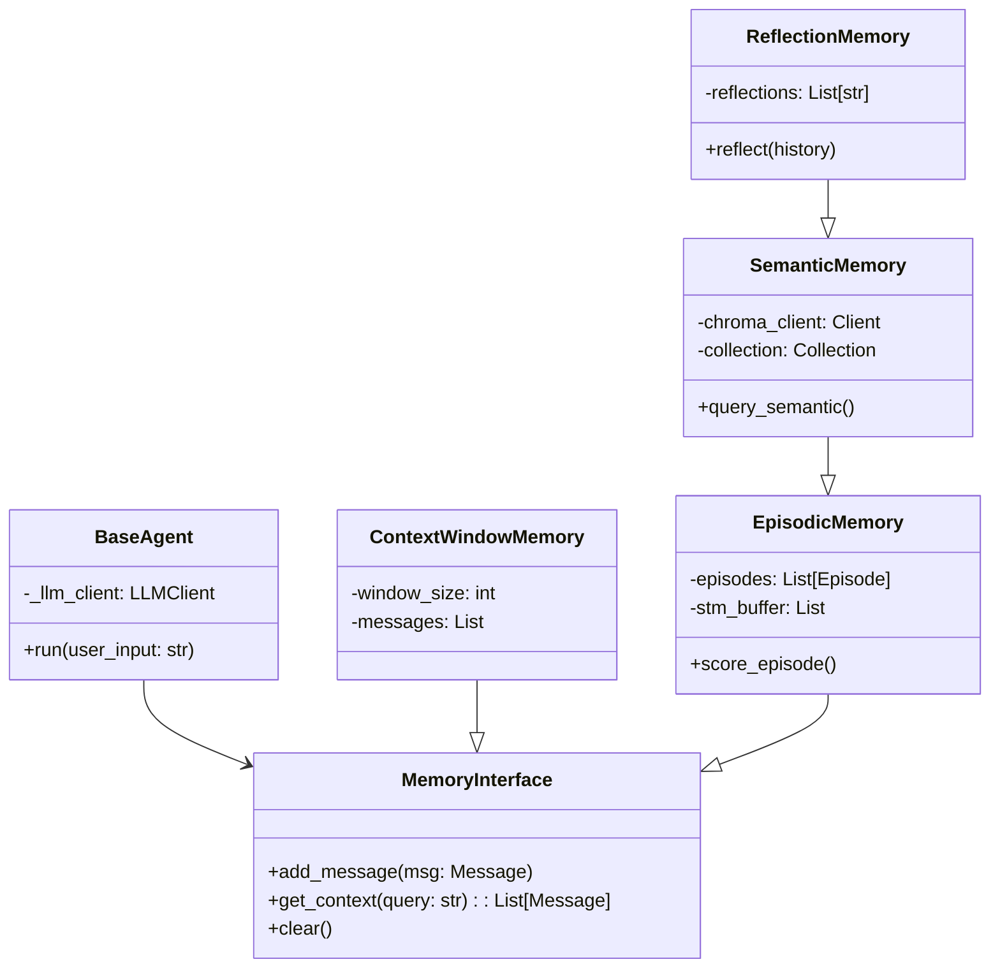
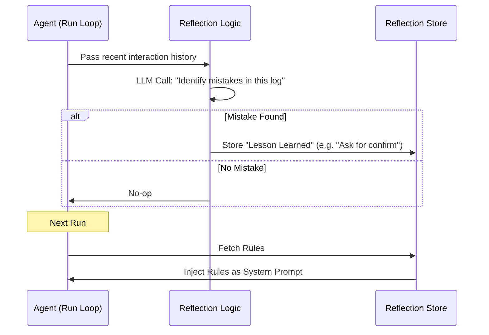

# Agent Memory Architecture: Technical Specification

**Version**: 1.0
**Date**: 2026-01-12
**Maintainer**: Engineering Team

---

## 1. System Overview

This system implements a modular, hierarchical memory architecture for LLM agents. It is designed to solve the *Context Window Constraint* by offloading specific types of information to specialized storage backends (JSON, VectorDB).

### 1.1 High-Level Architecture

The system follows a **Strategy Pattern** where the `BaseAgent` is agnostic to the underlying memory implementation, interacting only via the `MemoryInterface`.



---

## 2. Core Components

### 2.1 The Agent Loop (`src/agent.py`)

The `BaseAgent` executes a synchronous loop:

1. **Ingest**: Converts raw string to `Message` object.
2. **Context Assembly**: Calls `memory.get_context(query)`.
3. **Inference**: Sends `System Prompt + Context + User Input` to LLM.
4. **Storage**: Saves both User input and Agent response to memory.

### 2.2 Memory Implementations

#### A. Architecture B: Episodic Memory (`src/memory_episodic.py`)

**Purpose**: Store long-term narrative history without bloating context.

**Data Structure**:

```json
{
  "id": "uuid",
  "content": "User asked for refund...",
  "keywords": ["refund", "ticket"],
  "timestamp": 1705051234.5,
  "metadata": {}
}
```

**Retrieval Algorithm**:
Episodes are ranked using a hybrid score $S$:

$$ S = (\alpha \cdot K) + (\beta \cdot R) + (\gamma \cdot D) $$

Where:

* $K$ (Keyword Match): $\frac{|Query \cap Keywords|}{|Query|}$
* $R$ (Recency Boost): Bonus if $Timestamp > Now - 1 hour$
* $D$ (Time Decay): $e^{-\frac{\Delta t}{\tau}}$
* Current Tunings: $\alpha=0.5, \beta=0.3$

#### B. Architecture C: Semantic Memory (`src/memory_semantic.py`)

**Purpose**: Hard fact retention (RAG).

**Technology**:

* **Backend**: ChromaDB (Embedded Parquet/SQLite)
* **Embedding**: Default `all-MiniLM-L6-v2` (via Chroma default)
* **Schema**:
  * `document`: Raw text content.
  * `metadata`: `{"role": "user", "timestamp": "..."}`
  * `id`: UUID.

**Flow**:

1. **Write**: `add_message()` -> embeds user messages asynchronously.
2. **Read**: `get_context()` -> `collection.query(query_texts=[input], n_results=k)`.

#### C. Architecture D: Reflection Memory (`src/memory_reflection.py`)

**Purpose**: Self-correction and behavioral adaptation.

**The Reflection Loop**:
This is a meta-process that can be triggered typically `on_task_completion` or `on_user_feedback`.



---

## 3. Data Flow & Context Composition

When `get_context(query)` is called on **Architecture D**, the pipeline is:

1. **Reflection Layer**:
    * Fetch all high-priority rules.
    * Create `SystemMessage(content="CRITICAL INSTRUCTIONS: ...")`.
2. **Semantic Layer**:
    * Query VectorDB for top-2 facts.
    * Create `SystemMessage(content="[Semantic]: ...")`.
3. **Episodic Layer**:
    * Scan JSON episodes.
    * Calculate Score $S$ for each.
    * Return Top-3 relevant episodes `SystemMessage(content="[Memory]: ...")`.
4. **STM Layer**:
    * Append last $N$ messages verbatim.

**Final Context Bundle Sent to LLM**:

```text
[System]: You are a helpful assistant.
[System (Reflect)]: CRITICAL: ALWAYS ask for user confirmation.
[System (Semantic)]: User lives in Bangalore.
[System (Episodic)]: User previously asked about refund policies.
[User]: Book a flight to Bangalore.
```

---

## 4. Extensibility Guide

To add **Architecture E (Hierarchical Memory)**:

1. Create `src/memory_hierarchical.py`.
2. Inherit from `SemanticMemory`.
3. Implement clustering logic in `add_message`:

    ```python
    def add_message(self, msg):
        super().add_message(msg)
        self.cluster_manager.update(msg)
    ```

4. Update `get_context` to retrieve cluster summaries first, then drill down.

---

## 5. Configuration Parameters

| Parameter | Default | Location | Description |
| :--- | :--- | :--- | :--- |
| `window_size` | 5 | `agent.py` | Number of recent messages in STM |
| `top_k` | 3 | `memory_episodic.py` | Max episodes to retrieve |
| `decay_lambda`| 24 | `memory_episodic.py` | Time (hours) for memory to decay by 63% |
| `db_path` | `./chroma_db` | `memory_semantic.py` | Path for Vector Store |
